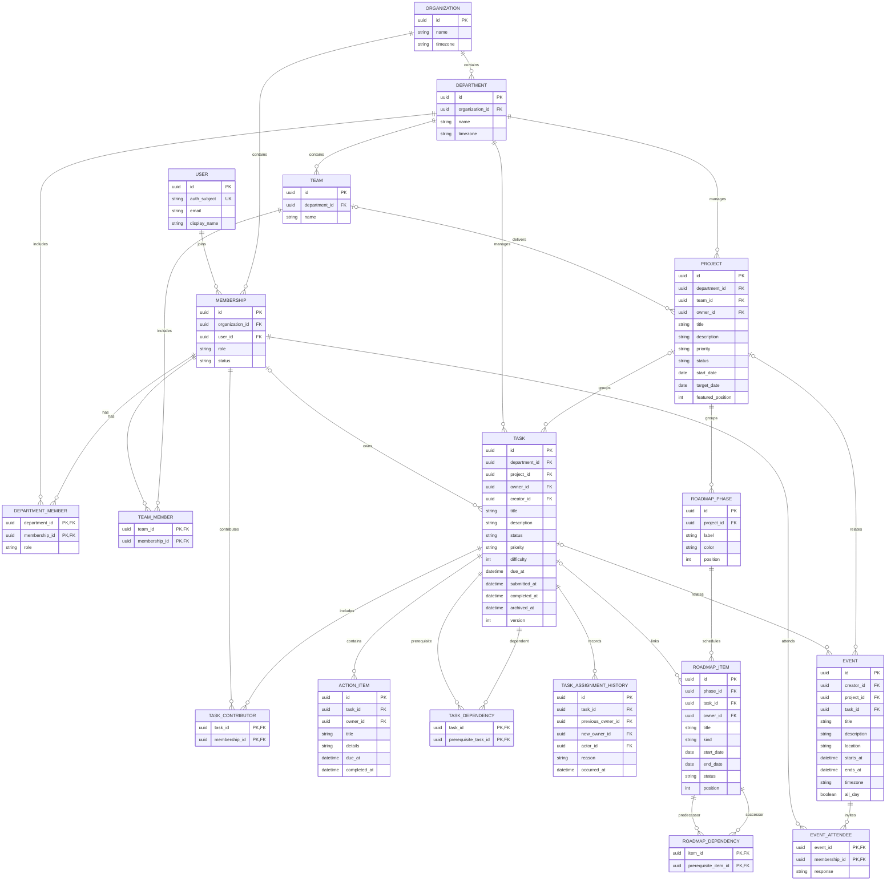
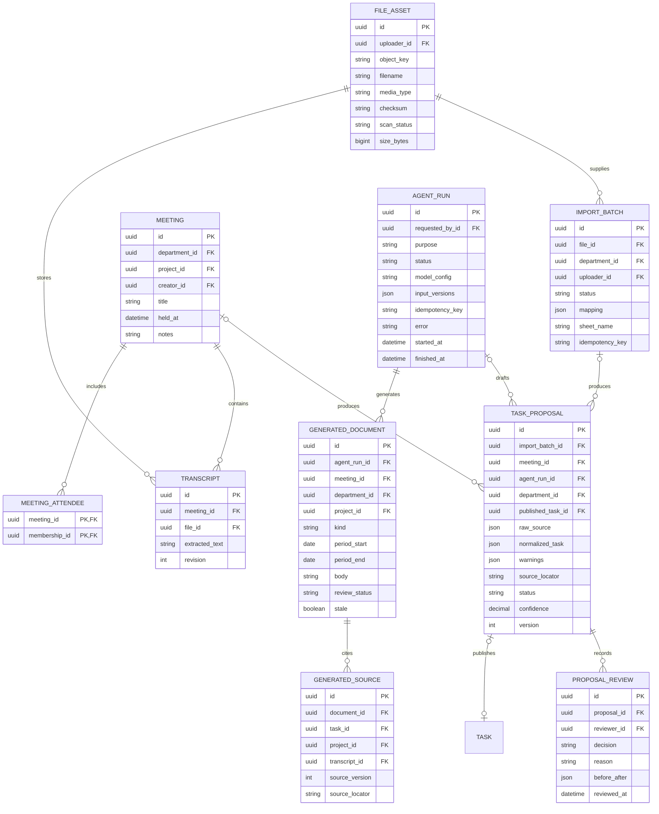
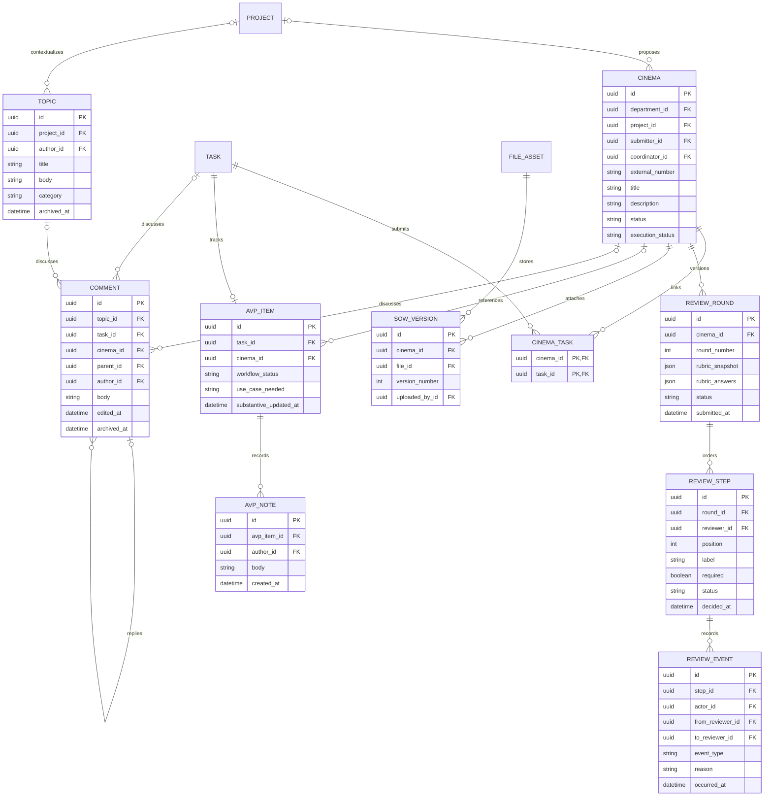

# Backend ERD

Proposed logical relational model. This is a schema specification, not an executed migration. UUID primary keys, organization scope, created_at/updated_at and optimistic version fields apply to business records unless noted. Nullable links are indicated below. Authentication secrets belong to the authentication provider, not these business tables.

## Core work

## Intake, meetings and agent output

A proposal has exactly one origin: import batch or meeting. Its published_task_id is nullable and unique. Each approved proposal creates exactly one task transactionally. Confidence is advisory. Store transcript excerpts or row coordinates in source_locator/raw_source; never discard originals. GENERATED_SOURCE has exactly one non-null source FK. Timeline drafts can use structured JSON payloads on GENERATED_DOCUMENT, validated before creating roadmap records. Job/run retries use unique organization-scoped idempotency keys.

## Cinema, AVP and discussion

## Supporting records and database constraints

- `AUDIT_EVENT(id, organization_id, actor_id, entity_type, entity_id, action, before_json, after_json, occurred_at)` is append-only. Entity identity is descriptive audit metadata, not a substitute for domain FKs.
- `ATTACHMENT(id, organization_id, file_id FK, task_id FK NULL, project_id FK NULL, event_id FK NULL)` uses exactly one non-null target. Cinema SOWs and transcripts use their explicit tables.
- `NOTIFICATION(id, organization_id, recipient_id FK, event_key, body, read_at)` and transactional `OUTBOX_EVENT(id, organization_id, event_key UNIQUE, payload, delivered_at)` support reliable in-app updates. External email delivery is a separately configured feature.
- `INVITATION(id, organization_id, department_id FK, email, token_hash, expires_at, accepted_at, invited_by_id FK)` stores hashed single-use tokens. Role changes require authorized admin commands.
- Organization-scoped composite foreign keys `(organization_id, id)` prevent cross-organization relationships, including ownership, files, comments and review handoffs. Every domain FK must use this scope; the diagrams omit repeated organization_id fields for readability.
- Unique `(organization_id,user_id)` memberships, `(project_id,featured_position)` for non-null featured positions 1–3, `(cinema_id,round_number)`, `(round_id,position)`, `(cinema_id,version_number)`, and `AVP_ITEM.task_id`. Cinema external numbers may be duplicated in imported references; use internal UUID identity and flag duplicates for review.
- `difficulty BETWEEN 1 AND 5`; enum/check constraints on priority and lifecycle states; date end >= start; event end > start; milestone start=end; required titles nonempty. Allow task due_at/owner_id and project links to be null where indicated in the brief.
- Roadmap task-linked dates must be synchronized through one service with a documented date-to-timezone conversion; reject edits that conflict with dependencies. Unlinked workstreams retain their own dates. Detect cycles transactionally for task and roadmap dependencies.
- COMMENT has exactly one topic/task/cinema target; parent must have the same target and organization. Enforce in transaction/trigger, not just the UI.
- Claim uses a conditional update where owner_id IS NULL and task is active; one concurrent claimant succeeds. Assignment, publication and review decisions lock/check current version before changing state.
- Index tasks by `(organization_id,owner_id,status,due_at)`, `(organization_id,department_id,priority,due_at)`; projects by scope/priority/date; meetings by held_at; events by time range; proposals by department/status; review steps by reviewer/status; notes/comments by parent/date. Add full-text indexes for task/event/project search.
- Profile queues, countdowns, progress and days since update are derived views, not independently editable copies. Update AVP substantive_updated_at on relevant task changes and AVP notes, in the same transaction.
- Store upload bytes in object storage; database retains metadata and version links. Archive referenced records instead of cascading away approval/source history.

The physical migration must expand omitted shared fields, all membership FKs and composite scope constraints. These diagrams define relationships and invariants; they do not assert that a database has been deployed.
